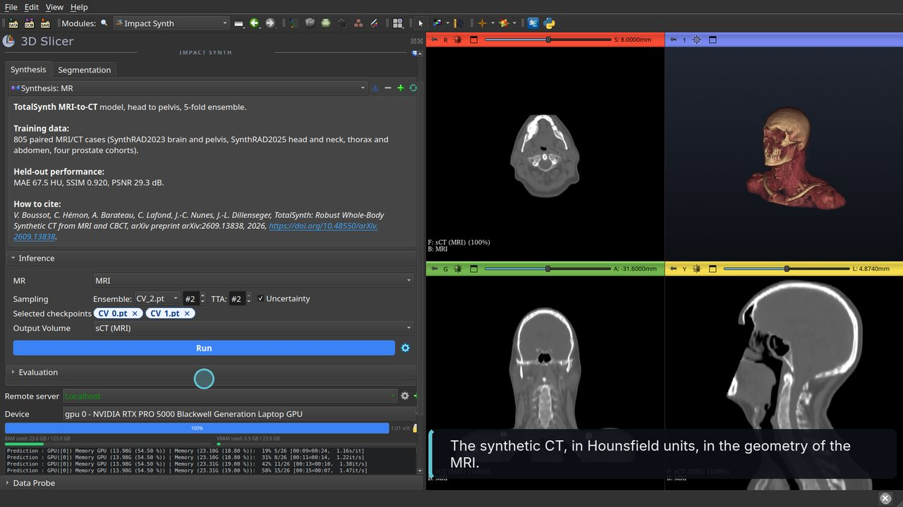
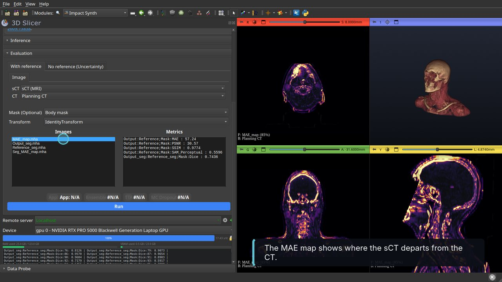
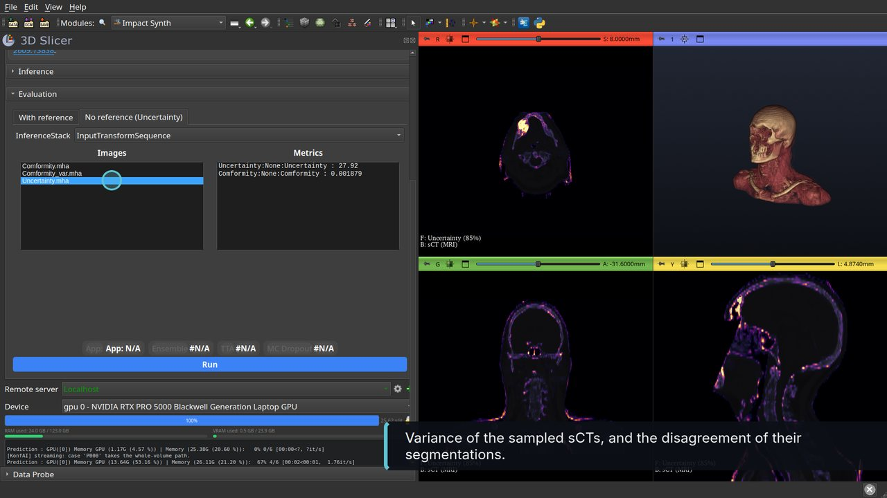
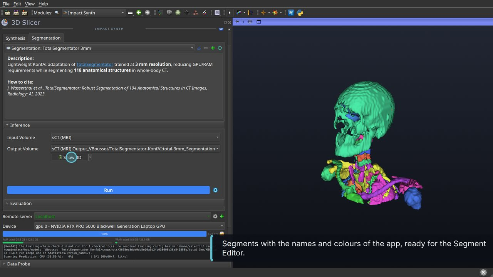

# 🧠 IMPACT-Synth: Synthetic CT from MRI and CBCT in 3D Slicer

[](https://github.com/vboussot/SlicerImpactSynth/blob/main/LICENSE)
[](https://huggingface.co/VBoussot/ImpactSynth)
[](https://github.com/vboussot/SlicerImpactSynth)
[](https://arxiv.org/abs/2609.13838)


**IMPACT-Synth** is a 3D Slicer extension for **synthetic CT (sCT) generation from MRI or CBCT**, with the quality-assurance tools needed to trust the result in radiotherapy workflows. It runs the **TotalSynth** models: pretrained whole-body sCT models covering the brain, head and neck, thorax, abdomen and pelvis, released as a dedicated **MRI-to-CT** model, a dedicated **CBCT-to-CT** model and a **unified MRI/CBCT** model, each a 5-fold ensemble. The sCT is evaluated against a reference CT when one exists, its uncertainty is estimated when none does, and CT-trained segmentation models run on it. Everything is powered by **KonfAI**.

<br>

📚 Reference

> 🔗 TotalSynth: Robust Whole-Body Synthetic CT from MRI and CBCT
> Valentin Boussot, Cédric Hémon, Anaïs Barateau, Caroline Lafond, Jean-Claude Nunes, Jean-Louis Dillenseger
> [arXiv:2609.13838](https://arxiv.org/abs/2609.13838)

---

## 🌐 The ecosystem

- **[SlicerImpactSynth](https://github.com/vboussot/SlicerImpactSynth)** (this repo): the Slicer interface for synthesis, evaluation, uncertainty and segmentation of the sCT.
- **[TotalSynth models](https://huggingface.co/VBoussot/ImpactSynth)**: the pretrained MRI-to-CT, CBCT-to-CT, unified and fine-tuned apps on Hugging Face, with their training configurations.
- **[SlicerKonfAI](https://github.com/vboussot/SlicerKonfAI)**: the generic KonfAI extension this one is built on (app list, inference, QA, remote servers).
- **[KonfAI](https://github.com/fideus-labs/KonfAI)**: the engine. Apps, CLI (`impact-synth-konfai`, `konfai-apps`), fine-tuning, HTTP server.
- **[SlicerImpactReg](https://github.com/vboussot/SlicerImpactReg)** and **[ImpactLoss](https://github.com/vboussot/ImpactLoss)**: the IMPACT registration used to align the training pairs, and to align an sCT with a reference CT before evaluation.

---

## 🎥 Demonstration Video

<!-- Drop Screenshots/SlicerImpactSynth-tutorial.mp4 into the README editor on GitHub and paste the user-attachments URL it gives here: GitHub then embeds a player. -->


https://github.com/user-attachments/assets/0ead176b-3e2c-4265-9403-ca4ee34fd53f


**[Watch the walkthrough](Screenshots/SlicerImpactSynth-tutorial.mp4)** (2 min, with captions), recorded on a head-and-neck MRI/CT pair and a head-and-neck CBCT/CT pair of the public SynthRAD2025 dataset.
👉 Step by step with screenshots: [`TUTORIAL.md`](TUTORIAL.md)

| Synthesis | Evaluation with a reference CT |
|-----------|--------------------------------|
|  |  |
| *The synthetic CT over the MRI.* | *MAE, PSNR, SSIM, Dice and the MAE map.* |

| Uncertainty without reference | Segmentation of the sCT |
|-------------------------------|-------------------------|
|  |  |
| *Voxel-wise uncertainty from the ensemble and TTA spread.* | *TotalSegmentator on the synthetic CT.* |

---

## ✨ Key Features

- **Whole-body pretrained models**
  TotalSynth covers the brain, head and neck, thorax, abdomen and pelvis with one MRI-to-CT model, one CBCT-to-CT model and one unified model, trained on 1450 quality-controlled SynthRAD2023/2025 pairs and four prostate cohorts. Downloaded from Hugging Face on first use.

- **One click from the loaded image to the sCT**
  Pick the volume in the scene (DICOM, NIfTI, NRRD, MHA), a model, the checkpoints to ensemble and the test-time augmentations, click Run. The sCT is written in HU, in the geometry of the input, and overlaid on it. About 15 s per checkpoint on a 24 GB GPU, with two test-time augmentations.

- **Evaluation with a reference CT**
  MAE map, PSNR, SSIM, a perceptual distance in SAM 2.1 feature space, and the Dice of TotalSegmentator structures segmented on the sCT and on the CT. An optional mask and a transform (for example from IMPACT-Reg) restrict and align the comparison.

- **Uncertainty without reference**
  Tick *Uncertainty* at inference to keep every sampled prediction. The spread of the ensemble and of the augmentations gives a voxel-wise uncertainty map; the disagreement between the segmentations of the sampled sCTs gives a conformity map.

- **Domain adaptation through the sCT**
  A second tab runs TotalSegmentator, MRSegmentator and IMPACT-Seg on the input image or on the sCT, so CT-trained models work on MRI and CBCT anatomy.

- **Fine-tuning from the released weights**
  Each app ships its training configuration. `konfai-apps fine-tune` starts from a checkpoint on your own registered pairs, and the result runs in Slicer like any other app.

- **Local GPU, CPU or remote server**
  The batch size is measured on the card (8 GB of VRAM is enough). A `konfai-apps-server` on a GPU workstation does the computation instead, with its GPUs and memory shown in the panel.

---

## 🏆 Challenge Results

The synthesis pipeline behind TotalSynth was developed for the SynthRAD 2025 challenge.
🔗 [SynthRAD 2025](https://synthrad2025.grand-challenge.org/)

| Challenge | Task | Rank |
|-----------|------|------|
| **SynthRAD 2025** | Task 1, MRI → CT | 🥉 3rd |
| **SynthRAD 2025** | Task 2, CBCT → CT | 🥉 3rd |

---

## 📊 Performance

Held-out cases, metrics inside the body mask against the registered planning CT (mean values, details and standard deviations in the [paper](https://arxiv.org/abs/2609.13838) and on the [model card](https://huggingface.co/VBoussot/ImpactSynth)).

| Model | Input | Training pairs | MAE (HU) | SSIM | PSNR (dB) |
|-------|-------|:--------------:|:--------:|:----:|:---------:|
| **MRI-to-CT** | MRI | 805 | 67.5 | 0.920 | 29.3 |
| **CBCT-to-CT** | CBCT | 929 | 53.6 | 0.939 | 32.1 |
| **Unified**, MRI inputs | MRI or CBCT | 1734 | 67.7 | 0.920 | 29.2 |
| **Unified**, CBCT inputs | MRI or CBCT | 1734 | 54.2 | 0.938 | 31.9 |
| **MRI-to-CT**, direct on BIC-MAC | whole-body Dixon MRI | 805 | 100.9 | 0.968 | 26.7 |
| **MRI-to-CT fine-tuned** on BIC-MAC | whole-body Dixon MRI | 805, then 45 | 62.2 | 0.982 | 30.5 |

| Region | 🧲 MRI-to-CT MAE (HU) | 🩻 CBCT-to-CT MAE (HU) |
|--------|:---------------------:|:----------------------:|
| Pelvis | 48.2 | 34.8 |
| Thorax | 58.5 | 57.3 |
| Abdomen | 60.1 | 57.2 |
| Brain | 79.7 | 39.4 |
| Head and neck | 80.9 | 67.5 |

> ⚠️ The BIC-MAC rows show the effect of domain shift: whole-body Dixon MRI is far from the radiotherapy training data, and fine-tuning on 45 local cases brings the error back to the in-distribution range. Validate on your own data before any clinical use, and fine-tune when the images differ from the training domain.

---

## 🧭 Which model?

| 🧪 Scenario | 🔧 App | 💡 Rationale |
|-------------|--------|--------------|
| **MRI-only planning**, diagnostic or MR-Linac MRI | **Synthesis: MR** | Trained on 805 MRI/CT pairs across five regions and several MRI contrasts. |
| **CBCT-based adaptive radiotherapy** | **Synthesis: CBCT** | Lower error than the MRI model; removes scatter and cupping while keeping the CBCT anatomy. |
| **One pipeline for both modalities** | **Synthesis: MR/CBCT** | Within 1 HU of the dedicated models; simpler deployment. |
| **Whole-body Dixon MRI** (attenuation correction, PET/MR) | **Synthesis: MR fine-tuned (BIC-MAC)** | The MRI model adapted to whole-body Dixon contrast. |
| **Your own scanner and protocol** | any of the above, then `konfai-apps fine-tune` | The released weights are an initialisation; 45 local pairs were enough on BIC-MAC. |

Use the full **5-checkpoint ensemble** with **TTA 2** for the final sCT, and a single checkpoint to explore. Tick **Uncertainty** whenever you will need the QA without reference.

---

## 🚀 Quick Start in Slicer

1. Install **3D Slicer ≥ 5.10**, then from the **Extensions Manager** the **PyTorch** extension (SlicerPyTorch) and **ImpactSynth**. The **KonfAI** extension is installed with it.
2. Restart Slicer and open **Impact Synth** (category **Image Synthesis**). On the first opening, `konfai-apps` is installed into Slicer's Python.
3. Load an MRI or a CBCT (**DICOM** module, or drag and drop a NIfTI / NRRD / MHA file). Load the registered planning CT too if you have one.
4. In the **Synthesis** tab, choose the app, select the **input volume**, add checkpoints to the **Ensemble**, keep **TTA** at 2, tick **Uncertainty**, click **Run**.
5. Open **Evaluation**:
   - **With reference**: output = the sCT, reference = the CT, optional mask and transform, **Run**. Click an image of the result list to load it (`MAE_map`, `Output_seg`, `Reference_seg`, `Seg_MAE_map`).
   - **No reference (Uncertainty)**: the inference stack is preselected, **Run** (`Uncertainty`, `Comformity`, `Comformity_var`).
6. In the **Segmentation** tab, run *TotalSegmentator 3mm* on the sCT and click **Show 3D**.

👉 Every step with a screenshot: [`TUTORIAL.md`](TUTORIAL.md)

---

## ⚙️ From the command line

The same apps run outside Slicer, on the same weights:

```bash
pip install impact_synth_konfai
impact-synth-konfai synthesize MR -i mr.nii.gz -o Output --gpu 0 --ensemble 5 --tta 2
impact-synth-konfai eval MR -i Output/sCT.mha --gt ct.nii.gz -o Evaluation --gpu 0
impact-synth-konfai pipeline CBCT -i cbct.mha --gt ct.mha -o Case01 --gpu 0 --ensemble 5 --tta 2 -uncertainty
```

or with the generic runner and a remote server:

```bash
konfai-apps infer VBoussot/ImpactSynth:MR -i mr.nii.gz -o Output --gpu 0 --ensemble 5 --tta 2
konfai-apps infer VBoussot/ImpactSynth:MR -i mr.nii.gz -o Output --host gpu-server --port 8000
konfai-apps fine-tune VBoussot/ImpactSynth:MR MyCenter_MR -d /data/pairs --models CV_0 --epochs 50 --gpu 0
```

⚠️ Give the apps the **raw images** (native MRI intensities, HU for CBCT and CT). Body mask, resampling and normalisation are part of each app.

---

## 🧩 What the extension is made of

The module registers two app templates on the `KonfAI` facade of the KonfAI extension: **Synthesis** (the four TotalSynth apps of `VBoussot/ImpactSynth`) and **Segmentation** (`VBoussot/TotalSegmentator-KonfAI`, `VBoussot/MRSegmentator-KonfAI`, `VBoussot/ImpactSeg`). The app list, the inference and evaluation panels, the process manager, the device and remote-server rows all come from [SlicerKonfAI](https://github.com/vboussot/SlicerKonfAI) (API version 2). Any other KonfAI app can be added to either tab from Hugging Face or from a local folder.

Run from source:

```bash
Slicer --additional-module-paths /path/to/SlicerKonfAI/KonfAI /path/to/SlicerImpactSynth/ImpactSynth
```

---

## 📚 References

1. Boussot, V., Hémon, C., Barateau, A., Lafond, C., Nunes, J.-C., Dillenseger, J.-L., **TotalSynth: Robust Whole-Body Synthetic CT from MRI and CBCT.** *arXiv:2609.13838*, 2026.
2. Boussot, V. & Dillenseger, J.-L., **KonfAI: A Modular and Fully Configurable Framework for Deep Learning in Medical Imaging.** *arXiv:2508.09823*, 2025.
3. Boussot, V., Hémon, C., Nunes, J.-C., Dillenseger, J.-L., **Why Registration Quality Matters: Enhancing sCT Synthesis with IMPACT-Based Registration.** *arXiv:2510.21358*, 2025.
4. Boussot, V. *et al.*, **IMPACT: A Generic Semantic Loss for Multimodal Medical Image Registration.** *arXiv:2503.24121*, 2025.
5. Thummerer, A. *et al.*, **SynthRAD2025 Grand Challenge dataset: Generating synthetic CTs for radiotherapy from head to abdomen.** *Med. Phys.*, 52(7), 2025.
6. Hémon, C. *et al.*, **Modeling dose uncertainty in cone-beam computed tomography: Predictive approach for deep learning-based synthetic computed tomography generation.** *Phys. Imag. Rad. Oncol.*, 33, 2025.
