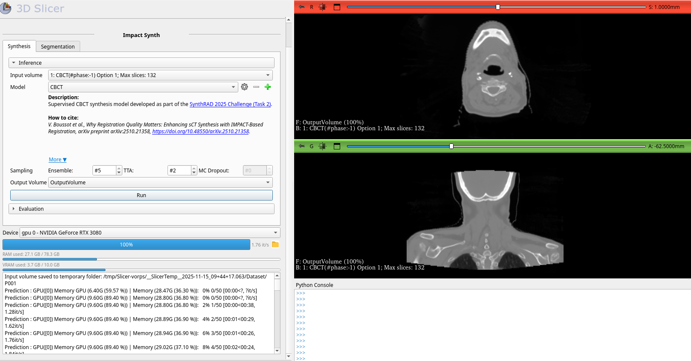
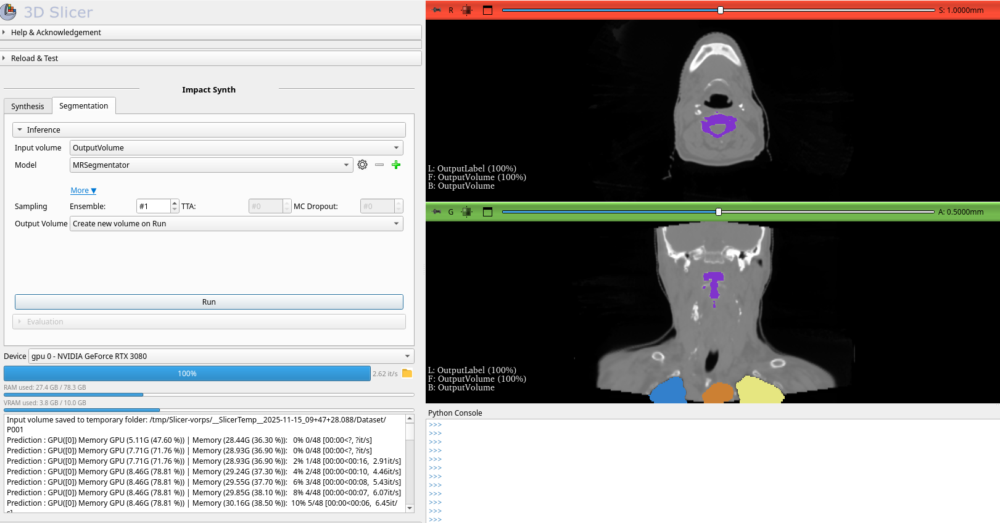
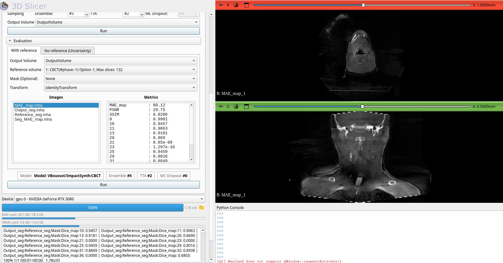

# 🧠 Slicer IMPACT-Synth  

**Slicer IMPACT-Synth** is an open-source 3D Slicer extension designed for the generation of **synthetic CT (sCT)** images from **MRI** or **CBCT**.  
It provides a dedicated integration of the IMPACT-Synth framework within the 3D Slicer environment, making advanced deep learning–based sCT generation as well as comprehensive quality-assurance (QA) tools accessible for routine clinical practice and research workflows in radiotherapy.

The extension leverages state-of-the-art models from the **SynthRAD 2025 Challenge [1]**, ranked *3rd* in both MRI→CT and CBCT→CT tasks, and is powered by **KonfAI [3]**, a modular deep learning framework ensuring **fast inference**, **reproducibility**, **flexible deployment** into clinical workflows.

Beyond sCT synthesis, the extension also enables anatomical segmentation on both the input images and the generated sCTs, providing a unified environment for image synthesis, segmentation, and quality assurance within radiotherapy workflows.

---

## 🖼️ Interface Overview

| sCT synthesis interface | Segmentation interface |
|-------------------------|------------------------|
|  |  |
| *Figure 1 – sCT synthesis.* | *Figure 2 – Anatomical segmentation.* |

   
  <em>Figure 3 – Evaluation with reference.</em>

## 🎥 Demonstration Video

https://github.com/user-attachments/assets/dab67476-702e-4252-8680-b6fbf72e64e5

## ✅ What you can do in 3 minutes (step-by-step tutorial)

This quick tutorial demonstrates the typical clinical workflow: **load → run inference → review results → assess reliability**.

### 1) Install and open the module
1. Install **3D Slicer ≥ 5.6**
2. Open **3D Slicer** and go to **Extension Manager**
3. Search for **ImpactSynth**
4. Click **Install**
5. Restart Slicer and open the **ImpactSynth** module from the **Image synthesis** category

### 2) Load a case
1. In Slicer, click **DICOM** (or drag-and-drop a NIfTI / NRRD / MHA file)
2. Load a volume (e.g., `volume.nii.gz`)
3. Confirm the volume appears in the **Data** module and is visible in the slice views

### 3) Run inference
1. On ImpactSynth module go to the **Synthesis** and **Inference** tab
2. Select:
   - **Input volume**: `volume`
   - **KonfAI App**: choose an app (e.g., *Synthesis MR* or *Synthesis CBCT*)
3. Click **Run**
4. Wait for completion: Once the process finishes, the generated synthetic CT is automatically overlaid with the input entry in the slice views

✅ You can now inspect the results in 2D and 3D and adjust visualization (opacity, label colors, 3D rendering).

### 5) QA with reference
If you have a CT registered with the input image, you can further validate the generated sCT:

1. Load the reference CT
2. Go to the **Synthesis** tab, then to the **Evaluation** tab
3. Select:
   - **Output volume** -> the generated sCT
   - **Reference volume** -> The CT
   - Optional **ROI mask**
4. Click **Run**
5. Review quantitative metrics and qualitative overlays inside Slicer:
    - **MAE_map**: voxel-wise Mean Absolute Error (MAE) map between the generated synthetic CT and the reference CT.
    - **Reference_seg** and **Output_seg**: anatomical segmentations of the reference CT and the generated sCT, automatically computed using MRSegmentator.
    - **Seg_MAE_map**: segmentation-based error map, measuring intensity discrepancies between the two segmentations on a region-by-region basis.
    
    **Reported metrics:**
    - MAE
    - PSNR
    - SSIM
    - Dice

### 4) QA without reference (uncertainty estimation)
When no ground truth annotation is available, you can still assess prediction reliability.

1. Go to the **Synthesis** tab, then to the **Evaluation** tab and select **No reference (Uncertainty)**
2. Select the **inference stack volume** generated during prediction
3. Click **Run**
4. Review the generated uncertainty outputs:
    - **Uncertainty**: voxel-wise variance map representing prediction uncertainty  
    - **Conformity**: map showing differences between segmentations from different generated sCTs  
    - **Conformity_var**: variance map computed between segmentations  

    **Reported metrics:**
    - **Uncertainty**: scalar value corresponding to the mean variance across the generated sCTs  
    - **Conformity**: scalar value corresponding to the mean variance across segmentations derived from the generated sCTs  

Uncertainty can be computed using:
- test-time augmentation (TTA)
- stochastic dropout
- multi-model ensembling  

These strategies are **configurable during the synthesis step** via the **sampling settings**.

## ⚙️ Features

### 🧩 Deep Learning Inference
- sCT generation from MRI or CBCT volumes  
- Supports **DICOM RT**, **NIfTI** (`.nii`, `.nii.gz`), and **MHA** formats  
- Automatic preprocessing and intensity normalization  

### ⚕️ Quality Assurance (QA)
- Automatic segmentation of both input and generated volumes  
- Quantitative metrics: **Dice**, **HD95**, **MAE**, **PSNR**, **MS-SSIM**  
- Synchronized **2D/3D visual inspection** within Slicer  

### 📉 Uncertainty Quantification
- Ensemble and test-time augmentation (TTA) strategies  
- Visualization of **aleatoric** and **epistemic** uncertainty maps  
- Exportable maps for **dose propagation [2]**  

### 💡 Integration-Ready
- Direct connection with **PACS** and DICOM RT import  
- Automatic end-to-end pipeline execution  
- Future compatibility with **IMPACT-Reg** for **dose accumulation** workflows  

---

## 🧠 Segmentation tab (domain adaptation)

In addition to the **Synthesis** tab, IMPACT-Synth provides a dedicated **Segmentation** tab.

This tab offers a set of **KonfAI segmentation apps** specialized for anatomical delineation, including:
- **TotalSegmentator**
- **MRSegmentator**

You can run these segmentation models on:
- the **input image** (MRI or CBCT)
- the **generated synthetic CT (sCT)**

Using the sCT as input enables **domain adaptation** for segmentation models that are originally trained on CT data, improving anatomical consistency and robustness when working with MRI or CBCT images.

This allows:
- direct comparison of segmentations across modalities  
- segmentation-based QA of the generated sCT  
- improved downstream tasks such as dose calculation and analysis

---

## 📊 Performance

| Metric | Abdomen | Head & Neck | Thorax | Mean |
|:-------|:---------|:-------------|:--------|:------|
| **MAE [HU]** | 49.7 | 52.0 | 44.0 | 48.6 |
| **PSNR [dB]** | 32.1 | 31.9 | 31.4 | 31.8 |
| **MS-SSIM** | 0.91 | 0.96 | 0.95 | 0.94 |

> Quantitative performance of IMPACT-Synth for CBCT→CT synthesis (SynthRAD2025 dataset).

---

## 📚 References

1. Thummerer, A. *et al.*, **SynthRAD2025 Grand Challenge dataset: Generating synthetic CTs for radiotherapy from head to abdomen.** *Med. Phys.*, 52(7), 2025.  
2. Hémon, C. *et al.*, **Modeling dose uncertainty in cone-beam computed tomography: Predictive approach for deep learning-based synthetic computed tomography generation.** *Phys. Imag. Rad. Oncol.*, 33, 2025.  
3. Boussot, V. & Dillenseger, J.-L., **KonfAI: A Modular and Fully Configurable Framework for Deep Learning in Medical Imaging.** *arXiv:2508.09823*, 2025.  
4. Boussot, V. *et al.*, **Why Registration Quality Matters: Enhancing sCT Synthesis with IMPACT-Based Registration.** *arXiv:2510.21358*, 2025.  
5. Boussot, V. *et al.*, **IMPACT: A Generic Semantic Loss for Multimodal Medical Image Registration.** *arXiv:2503.24121*, 2025.  

---

*Slicer IMPACT-Synth provides an open, transparent, and extensible environment for synthetic CT generation and QA in adaptive radiotherapy — bridging deep learning and clinical usability within 3D Slicer.*

