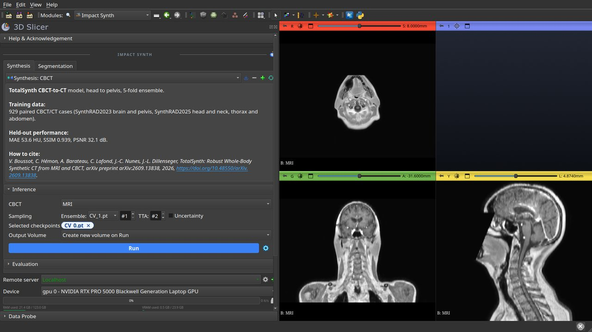
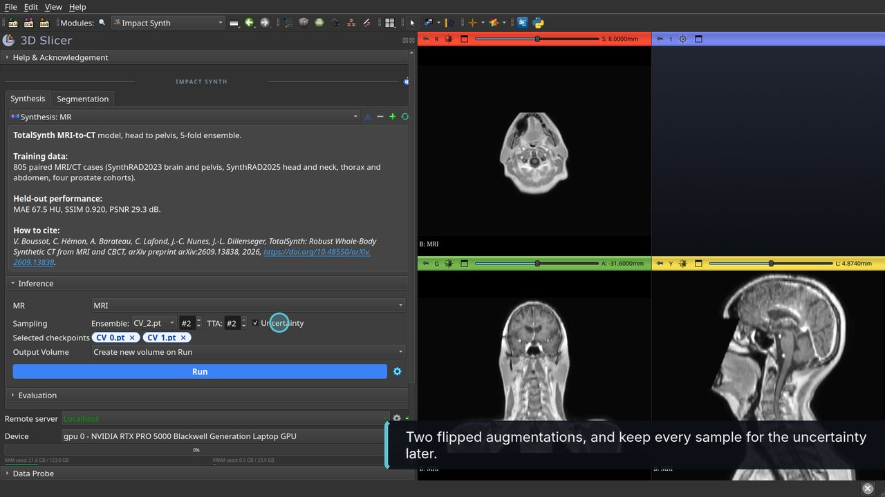
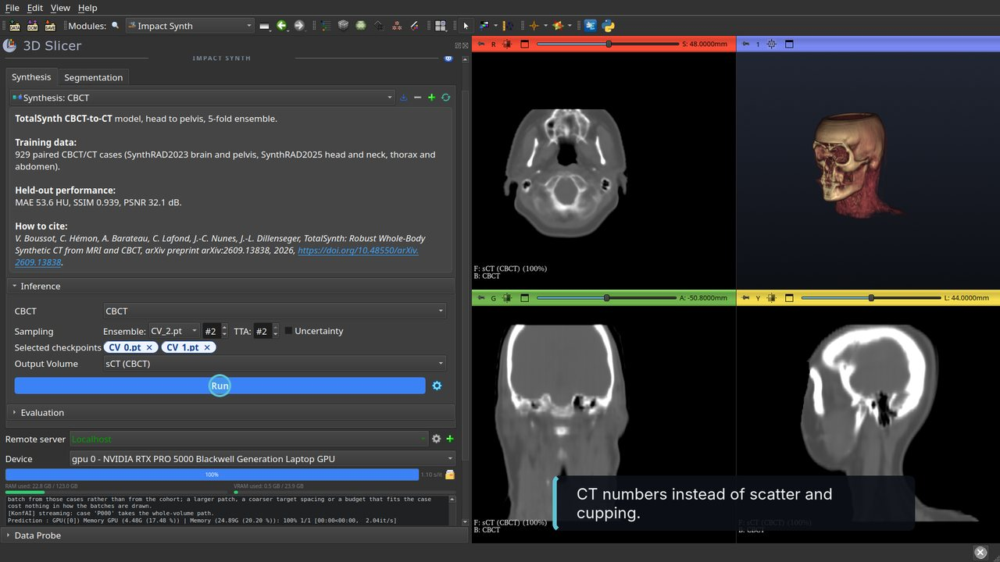
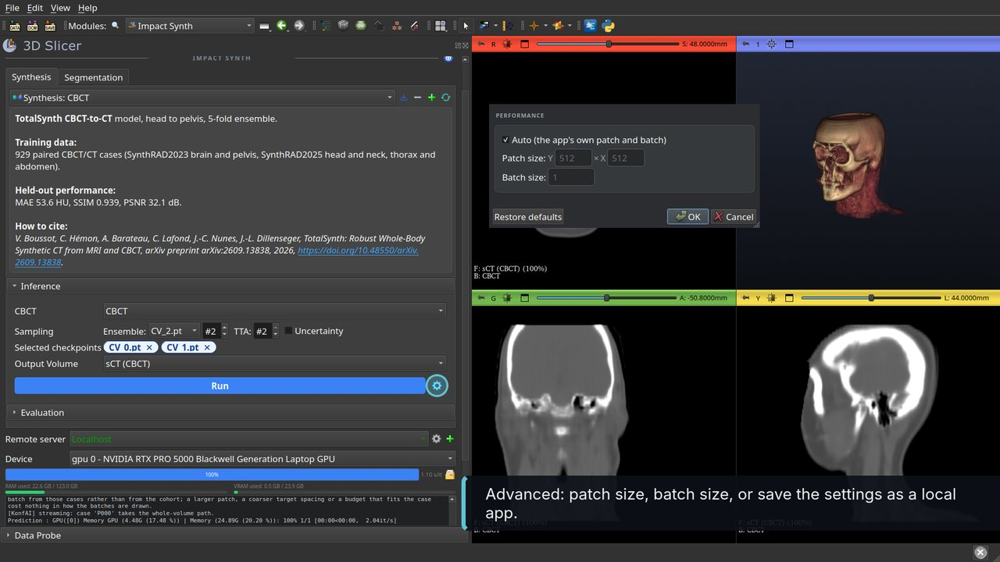

# Walkthrough

Video with captions: [SlicerImpactSynth-tutorial.mp4](Screenshots/SlicerImpactSynth-tutorial.mp4) (2 min).

Recorded on two public cases of the [SynthRAD2025](https://synthrad2025.grand-challenge.org/)
challenge: a head-and-neck MRI/CT pair (1HNA001, 533 × 390 × 177 voxels of 1 × 1 × 2 mm, from
the [konfai-demo](https://huggingface.co/datasets/VBoussot/konfai-demo) dataset) and a
head-and-neck CBCT/CT pair (2HNA002, 1 × 1 × 3 mm). The CT of each pair is the registered
planning CT, used here as the reference. Recorded on an RTX PRO 5000 (24 GB); the waits are
played faster in the video. A DICOM series loaded through the DICOM module works the same way.

1. **Install** the extension and open **Impact Synth** (category *Image Synthesis*). On the first
   opening the module installs `konfai-apps` into Slicer's Python; PyTorch comes from the
   SlicerPyTorch extension. Load the MRI (drag and drop, or *Add Data*).

   

2. **Choose the model.** In the *Synthesis* tab the app list holds the four TotalSynth apps.
   *Synthesis: MR* is the dedicated MRI-to-CT model. The card under the list gives the training
   data and the held-out performance; click it for the full description. The **Ensemble** row
   lists the five checkpoints: one is selected, pick more to average them. **TTA** is the number
   of flipped test-time augmentations. **Uncertainty** keeps every sampled prediction for the
   evaluation without reference.

   

3. **Run.** The input is written to a temporary folder and `konfai-apps infer` runs in a separate
   process. The log shows its output, the progress bar and the speed follow it, and the RAM and
   VRAM gauges show the memory of the selected device. The sCT is loaded as a new volume, shown
   as foreground over the MRI with a CT window. Two checkpoints with two augmentations take
   about 30 s on this card.

   

4. **Evaluate against the planning CT.** Open *Evaluation*, tab *With reference*: the output is
   the sCT, the reference is the CT, the mask is optional (here the body mask of the case) and a
   transform can align the output with the reference. Run. The *Metrics* list gives MAE, PSNR,
   SSIM, the SAM perceptual distance and the Dice between the TotalSegmentator segmentations of
   the sCT and of the CT. Click an image of the *Images* list to load it: the MAE map, the two
   segmentations, the per-structure Dice map.

   

5. **Estimate uncertainty without reference.** Tab *No reference (Uncertainty)*: the inference
   stack written at step 3 is preselected. Run. The result is a voxel-wise variance map of the
   sampled sCTs (in HU², also as a percentage of the model's validation variance), a conformity
   map showing where the TotalSegmentator segmentations of the sampled sCTs disagree, and their
   means as metrics.

   

6. **Segment the sCT.** The *Segmentation* tab offers TotalSegmentator (CT and MRI models),
   MRSegmentator and IMPACT-Seg. Run *TotalSegmentator 3mm* on the sCT: a CT-trained model
   segments MRI anatomy through the synthetic CT. The result is a Segmentation node with the
   names and colours of the app; **Show 3D** renders it.

   

7. **CBCT to CT.** Load a CBCT, choose *Synthesis: CBCT* (or *Synthesis: MR/CBCT*, the unified
   model), Run. The sCT replaces the CBCT scatter and cupping artefacts by CT numbers.

   

8. **Device, remote server, advanced settings.** The *Device* row lists the CPU and the GPUs. A
   *Remote server* running `konfai-apps-server` does the computation elsewhere; its GPUs and its
   memory replace the local ones in the panel. The gear next to Run opens the *Advanced* dialog:
   patch size, batch size, and *Save as local app* to keep those settings as a new app.

   

From the command line, the same run is:

```bash
konfai-apps infer VBoussot/ImpactSynth:MR -i MR.mha -o Output --gpu 0 --ensemble 2 --tta 2 -uncertainty
konfai-apps eval VBoussot/ImpactSynth:MR -i Output/sCT.mha --gt CT.mha --mask MASK.mha -o Evaluation --gpu 0
konfai-apps uncertainty VBoussot/ImpactSynth:MR -i Output/InferenceStack.mha -o Uncertainty --gpu 0
```
